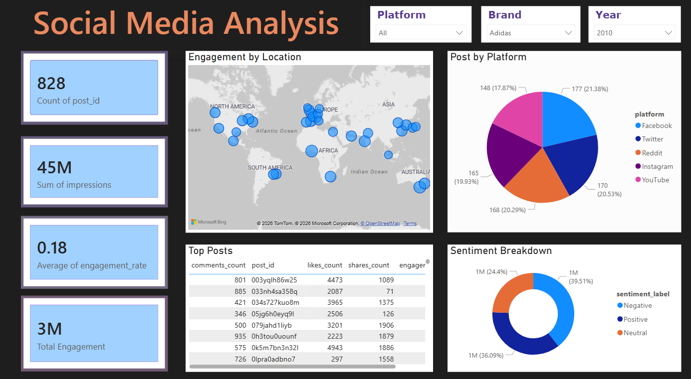
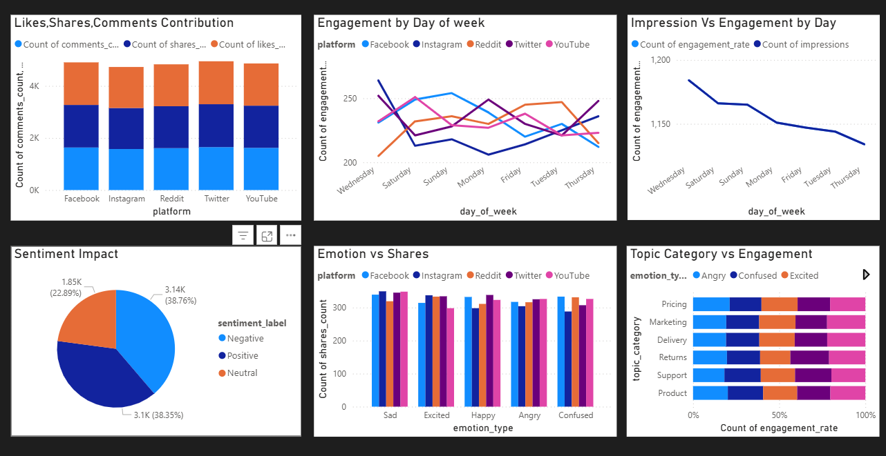

# 📊 Power BI Social Media Dashboard

![Power BI] ![Data Analysis] ![DAX] ![Data Modeling] ![Charts]

 

💼 This dashboard analyzes social media performance metrics to generate actionable business insights using Power BI
📈 Helps identify top-performing platforms, engagement trends, and optimize content strategy.

---

## 📌 Project Overview

This dashboard analyzes engagement, impressions, shares, and content performance across multiple platforms.
Interactive filters allow users to explore trends, top-performing platforms, and audience behavior.

---

## 🔗 Live Dashboard
💼 This project demonstrates

👉 [View Interactive Power BI Dashboard](https://app.powerbi.com/groups/me/reports/d5edfde9-3b41-420b-8f42-0af32927115e/324ccde100d3879ebd59?experience=power-bi))

---

## 📷 Dashboard Preview

---

## 🎯 Key Business Questions

* Which platform has the highest engagement?
* Which platform drives the most impressions?
* What trends can be observed across platforms?

---

## 🧠 Key Insights

* YouTube leads in engagement and impressions
* Facebook shows strong engagement consistency
* Twitter underperforms across metrics
* Instagram performs steadily

---

## 🛠 Tools Used

* Power BI
* DAX
* Data Modeling
* Data Cleaning

---

## 💡 Features

* Interactive filters & slicers
* KPI cards (Engagement, Shares, Impressions)
* Platform-wise comparison charts
* Dynamic visuals

---

## 💼 Business Impact

This dashboard helps businesses:

* Optimize content strategy
* Improve audience engagement
* Make data-driven marketing decisions

---

## 📂 Files

* Dashboard.pbix
* Dataset
* Screenshots

## 🚀 How to Use
1. Open the live dashboard  
2. Use filters (Platform, Time, etc.)  
3. Explore KPIs and trends across platforms  
